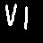

# RomanNumeralsClassifier
Test task for hackaton INT20H 2019

The program recognizes handwritten Roman numerals from 1 to 8,
using TensorFlow.

   \
   

**To run the program you need**
1) Download data set and model to project from [google disk](https://drive.google.com/open?id=1Cqjvu6HyuZ44ASgWqHw4qw28xPbdXxV3)
2) install dependencies  `$pip install -r requirements.txt`
3) Train and test the network in the jupyter notebook run.ipynb

The network classifies numbers on a test data with an accuracy of 0.9975

**Preparation of data**
Images was augmented using flipping, rotation and scaling
